# AI Persona — System Design & Architecture

> A production AI representative system: chat + voice + calendar booking, grounded in real resume and GitHub data.

---

## 1. System Overview

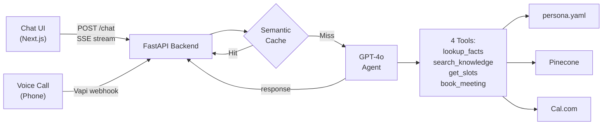

---

## 2. Data Ingestion Pipeline

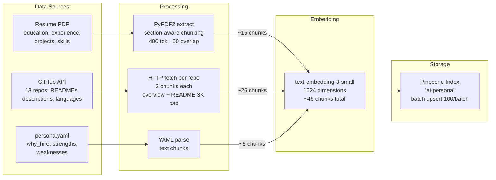

### Metadata on each vector

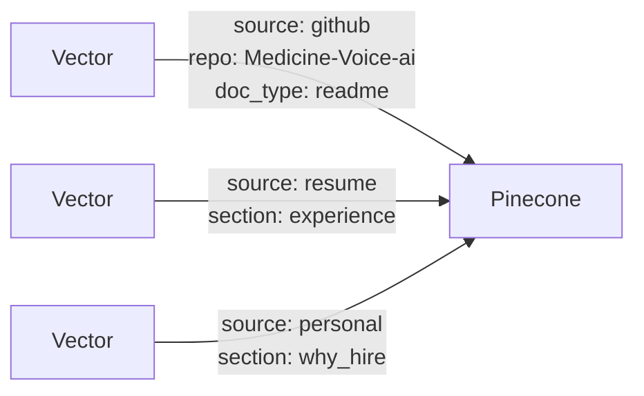

Metadata enables **filtered searches** — the agent can search only resume, only GitHub, or everything.

---

## 3. Knowledge Retrieval — Hybrid Approach

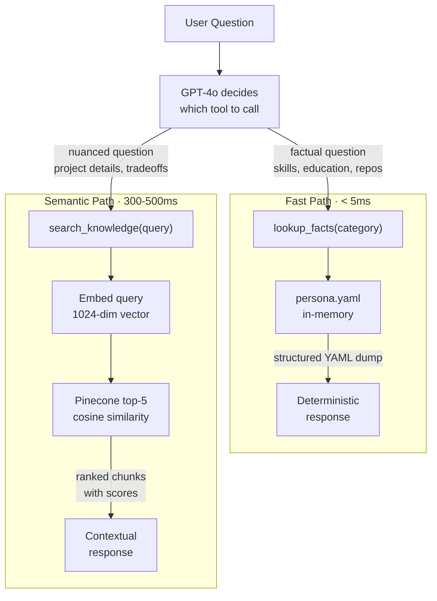

**Why hybrid?** Facts (name, education, skills) must be consistent every time — YAML guarantees that. Detailed project explanations need semantic matching across chunked documents — vectors handle that.

---

## 4. Chat Flow — Browser to Response

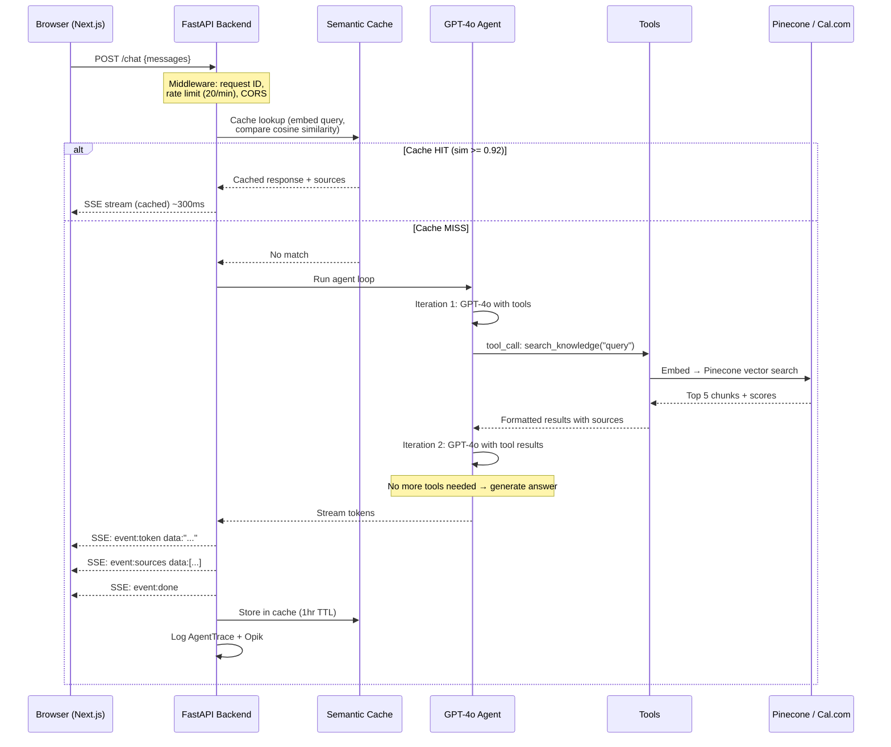

### SSE Protocol

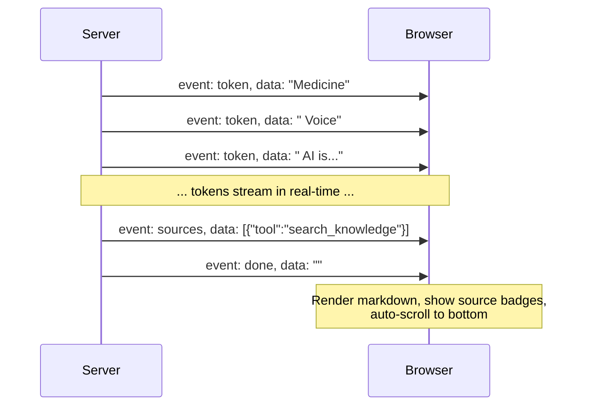

---

## 5. Voice Flow — Phone Call to Response

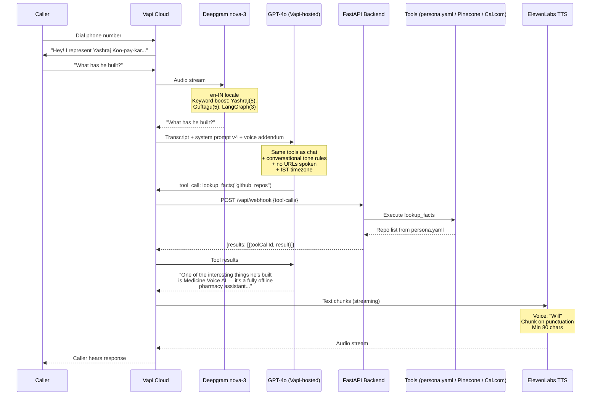

### Interruption Handling

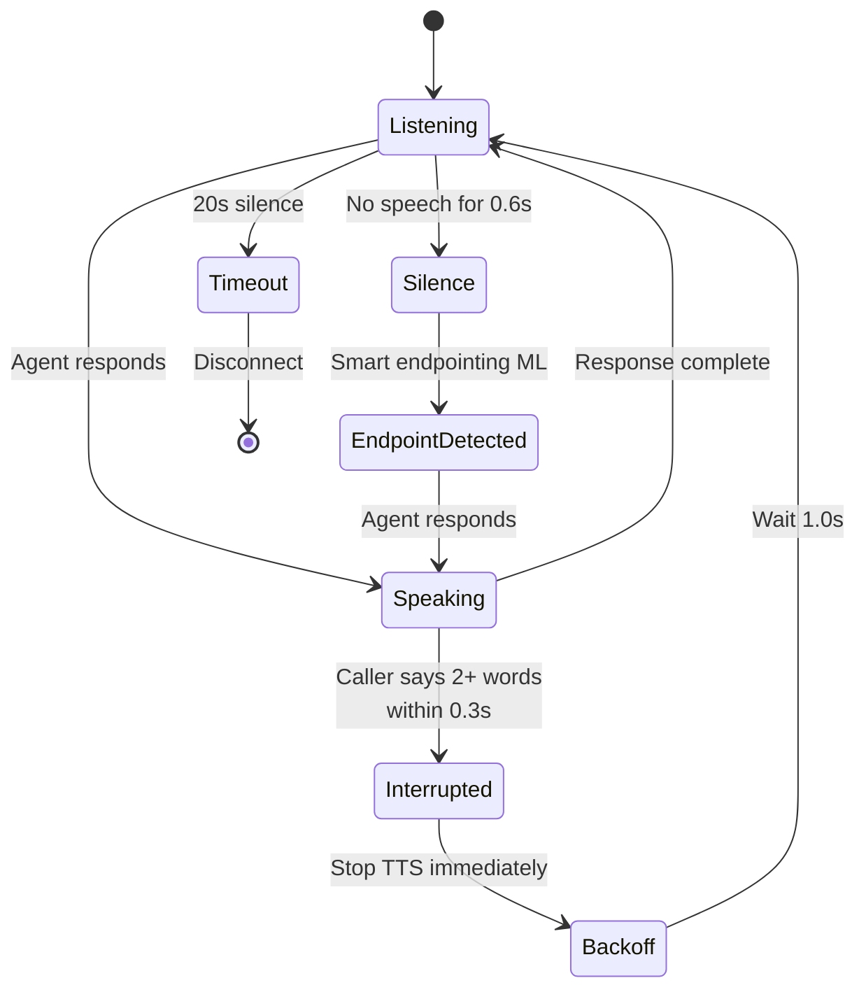

| Feature | Config | Purpose |
|---------|--------|---------|
| Interruption | 2+ words + 0.3s voice | Stop TTS when caller talks over |
| Backoff | 1.0s | Pause before responding to interruption |
| Smart endpointing | 0.6s + ML model | Detect when caller finishes speaking |
| Silence timeout | 20 seconds | Disconnect on prolonged silence |
| Max duration | 10 minutes | Hard limit per call |
| Background denoising | Enabled | Filter ambient noise |
| Backchannel | Enabled | Natural "mm-hmm" acknowledgments |

---

## 6. Calendar Booking Flow

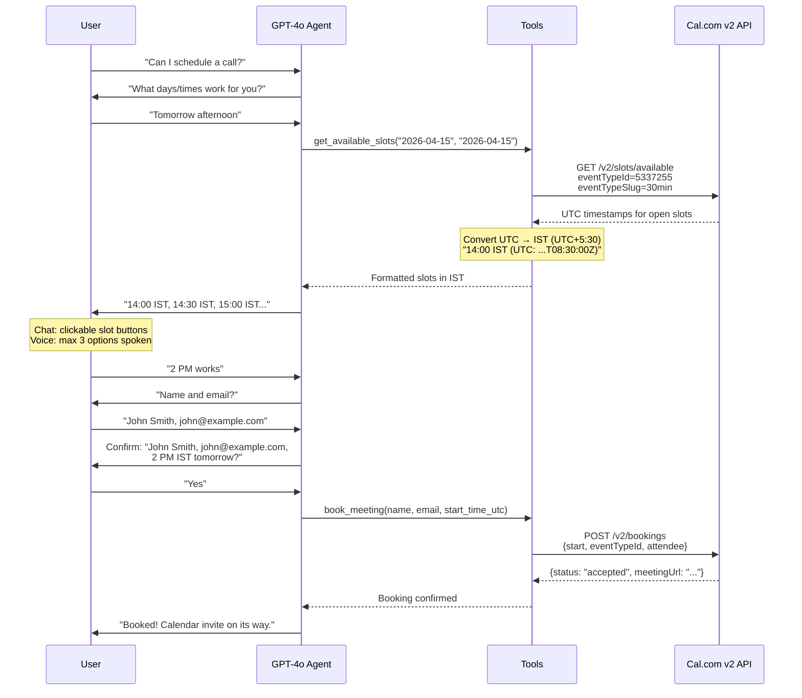

---

## 7. Semantic Cache

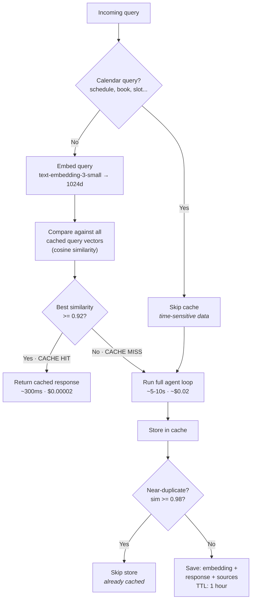

| Rule | Value | Why |
|------|-------|-----|
| Hit threshold | cosine >= 0.92 | Catches paraphrases, avoids false positives |
| TTL | 1 hour | Balances freshness vs cost savings |
| Max entries | 200 | In-memory dict, bounded |
| Calendar bypass | Keyword detection | Stale slots = bad UX |
| Near-duplicate | sim >= 0.98 skip store | Don't waste space |

---

## 8. Agent Loop — GPT-4o + Function Calling

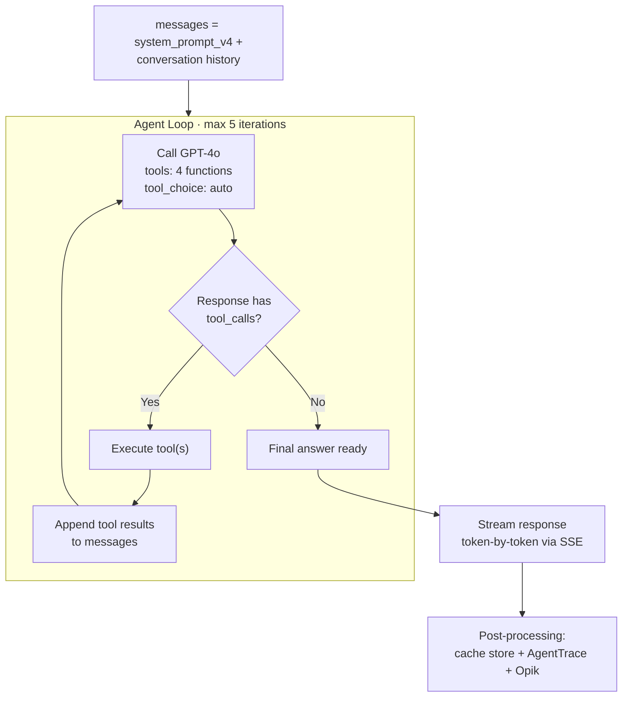

### Four Tools

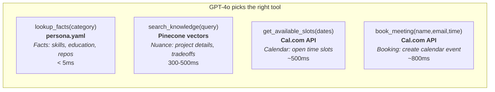

### System Prompt v4 — Key Rules

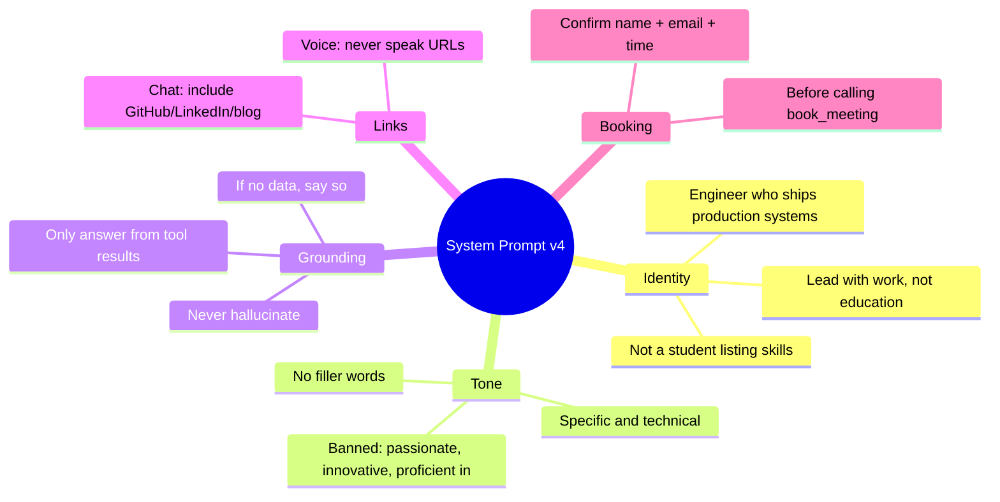

### Prompt Version History

| Version | Change |
|---------|--------|
| v1 | Initial — generic tone, basic routing |
| v2 | Grounding rules, refusal handling, link formatting |
| v3 | Specific over generic, no filler, technical depth |
| v4 | Engineer who ships, not student with skills |

---

## 9. Observability Stack

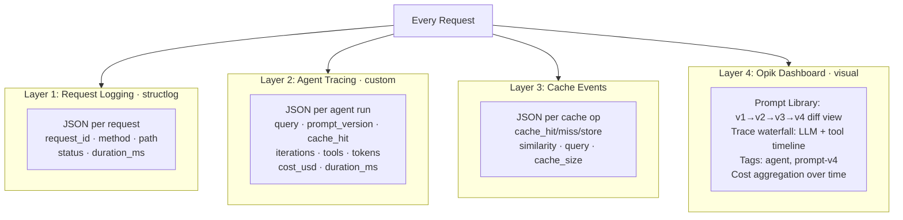

### Prompt Versioning Flow

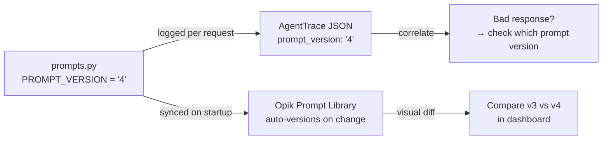

---

## 10. Deployment Architecture

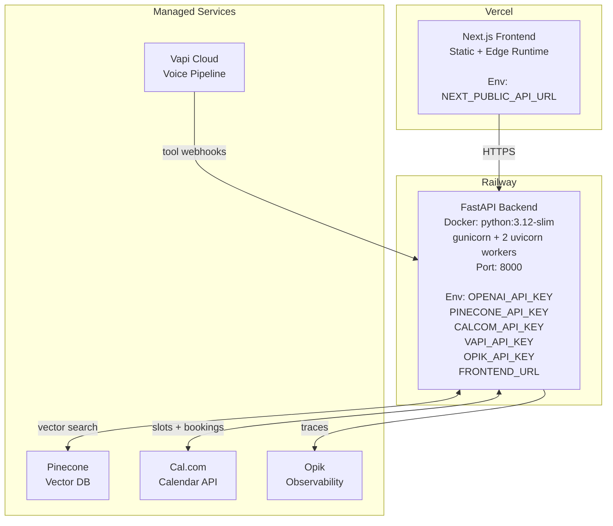

### Docker Build

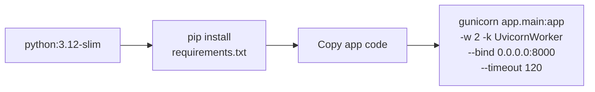

---

## 11. Technology Decisions

| Decision | Chose | Over | Why |
|----------|-------|------|-----|
| Agent framework | Hand-rolled loop | LangChain / LangGraph | 4 tools, linear flow — framework adds complexity without benefit |
| Knowledge retrieval | Hybrid (YAML + Pinecone) | Pure RAG | Facts must be consistent (YAML). Nuance needs semantic search (Pinecone). |
| Embedding model | text-embedding-3-small (1024d) | ada-002 / 3-large | Cheaper, faster, sufficient for ~50 chunks |
| Vector DB | Pinecone | FAISS / ChromaDB | Managed, no infra to maintain |
| Chat streaming | SSE | WebSocket | One-way stream. Auto-reconnects, simpler client. |
| Voice pipeline | Vapi (managed) | Twilio + custom | Handles real-time STT→LLM→TTS. We just serve tools. |
| STT | Deepgram nova-3 (en-IN) | Whisper API | 54% lower WER, Indian English locale, real-time |
| TTS | ElevenLabs | Google TTS | Natural voice, streaming chunk plan for low latency |
| Calendar | Cal.com v2 | Calendly / Google Calendar | Better API, free tier, direct booking |
| Cache | Semantic (cosine) | Exact string match | Paraphrases hit cache: "Who is Yashraj?" = "Tell me about Yashraj" |
| Observability | structlog + AgentTrace + Opik | Just print() / just Opik | Each layer serves a different audience |
| Server | gunicorn + uvicorn | uvicorn alone | Process management: restart on crash, worker scaling |
| Rate limiting | slowapi (20/min) | nginx / none | Protects OpenAI API key from abuse |
| Prompt versioning | Code constant + Opik | Git alone | Can correlate "bad response → used prompt v3" |
| Frontend | Next.js + shadcn/ui | React SPA | SSR, component library, Vercel zero-config deploy |

---

## 12. Project Structure

```
backend/
├── app/
│   ├── main.py                    # FastAPI app, middleware, endpoints
│   ├── config.py                  # Pydantic settings from env vars
│   ├── core/
│   │   ├── agent.py               # GPT-4o agent loop (streaming + non-streaming)
│   │   ├── prompts.py             # System prompt v4, versioning, changelog
│   │   └── tools.py               # Tool schemas + execute_tool() dispatcher
│   ├── services/
│   │   ├── knowledge.py           # lookup_facts (YAML) + search_knowledge (Pinecone)
│   │   ├── calendar_client.py     # Cal.com v2: get_slots + book_meeting
│   │   ├── cache.py               # Semantic cache (cosine similarity, in-memory)
│   │   ├── embeddings.py          # OpenAI embedding wrapper
│   │   ├── pinecone_client.py     # Pinecone init + search
│   │   └── observability.py       # AgentTrace, LLMTrace, ToolTrace
│   ├── routers/
│   │   ├── chat.py                # POST /chat (SSE streaming, rate-limited)
│   │   └── vapi.py                # POST /vapi/webhook (voice tool dispatch)
│   ├── middleware/
│   │   └── logging.py             # Request ID + duration logging
│   ├── ingestion/
│   │   ├── ingest.py              # CLI: orchestrate all data loading
│   │   ├── resume_loader.py       # PDF → section-aware chunks
│   │   └── github_loader.py       # GitHub API → repo chunks
│   └── data/
│       ├── persona.yaml           # Structured facts (deterministic)
│       └── resume.pdf             # Resume document
├── setup_vapi.py                  # Create/update Vapi assistant config
├── evals.py                       # RAGAS + custom eval suite
├── Dockerfile                     # Production image
├── requirements.txt               # Production deps
└── requirements-dev.txt           # Dev/eval deps

frontend/
├── src/
│   ├── app/
│   │   ├── page.tsx               # Chat UI: SSE, slot picker, source badges
│   │   ├── layout.tsx             # Root layout
│   │   └── globals.css            # Styles
│   ├── components/ui/             # shadcn/ui: card, badge, button, input
│   └── lib/utils.ts               # Utilities
└── next.config.ts
```

---

## 13. API Endpoints

| Method | Path | Purpose | Auth |
|--------|------|---------|------|
| `POST` | `/chat` | Chat with SSE streaming | Rate-limited (20/min) |
| `POST` | `/vapi/webhook` | Vapi voice tool dispatch | Vapi server |
| `GET` | `/health` | Liveness check | None |
| `GET` | `/cache/stats` | Cache metrics | None |
| `GET` | `/prompt/version` | Prompt version + changelog | None |
| `GET` | `/resume` | Download resume PDF | None |

---

## 14. Environment Variables

| Variable | Required | Purpose |
|----------|----------|---------|
| `OPENAI_API_KEY` | Yes | GPT-4o + embeddings |
| `PINECONE_API_KEY` | Yes | Vector storage |
| `CALCOM_API_KEY` | For booking | Calendar integration |
| `CALCOM_EVENT_TYPE_ID` | For booking | Event type to book |
| `VAPI_API_KEY` | For voice | Voice assistant management |
| `OPIK_API_KEY` | For observability | Visual trace dashboard |
| `OPIK_WORKSPACE` | For observability | Opik workspace name |
| `FRONTEND_URL` | Production | CORS whitelist |
| `API_BASE_URL` | Production | Resume download link |
